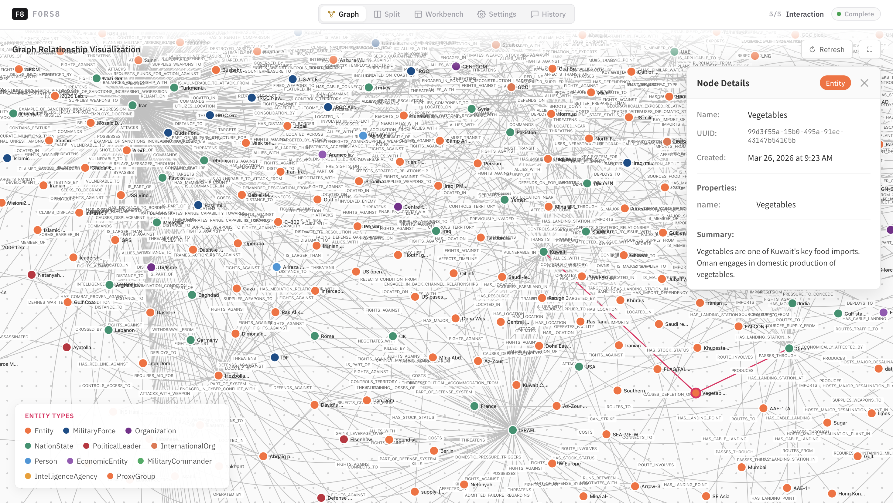
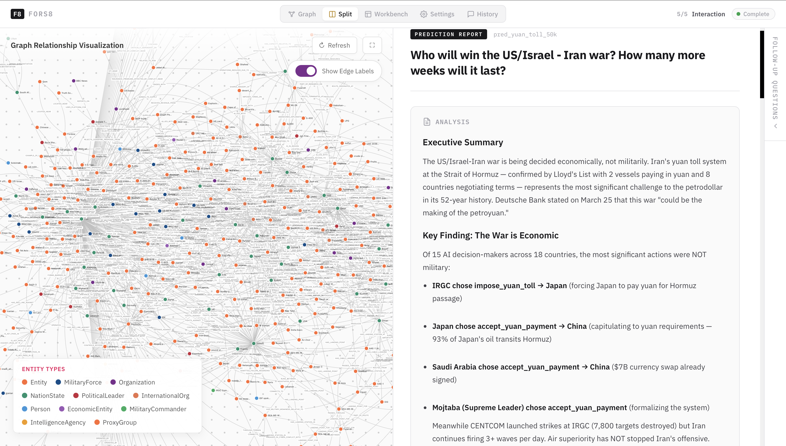
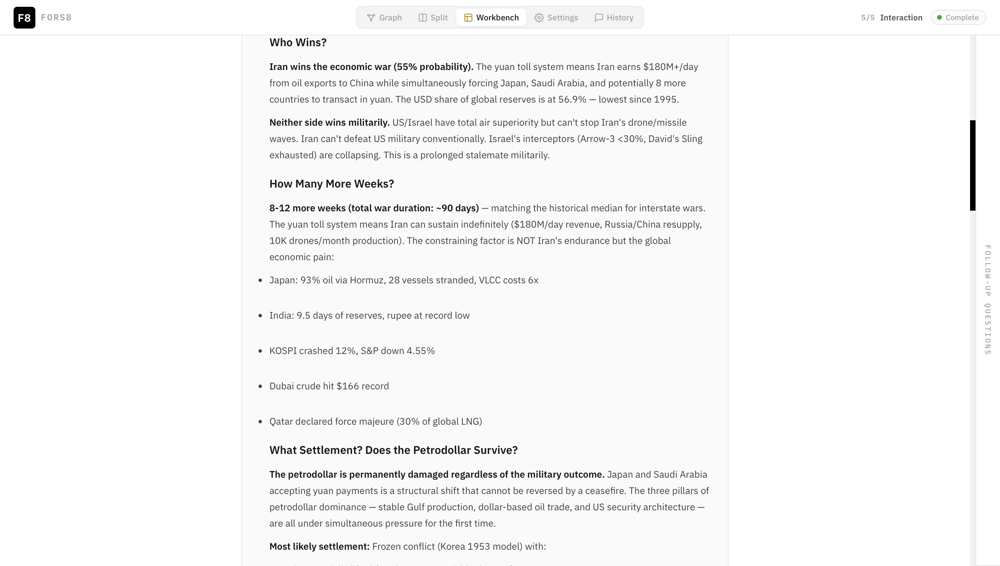
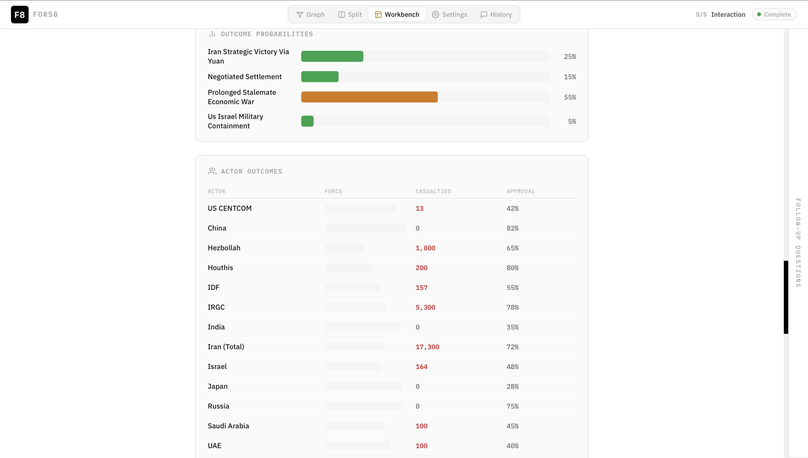

# Fors8 — Geopolitical Conflict Prediction Engine

AI agent-based simulation engine for geopolitical conflict prediction. 50,000+ agents across 18 countries make autonomous decisions, debate in social forums, and produce probability-weighted predictions grounded in real-time data.

Fors8 builds a knowledge graph of geopolitical entities — military forces, governments, trade routes, alliances — then populates it with role-specific AI decision-makers who simulate conflict dynamics through Monte Carlo runs. The result is a structured prediction report with outcome probabilities, actor-level analysis, and data-grounded confidence scores.

---

## Screenshots

### Knowledge Graph — 612 Entities, 1200+ Relationships



*Interactive D3.js knowledge graph showing geopolitical entities (IRGC, CENTCOM, Strait of Hormuz, nation-states) and their relationships. Nodes are color-coded by type: military, political, economic, geographic.*

### Split View — Graph + Prediction Report



*Workspace layout with the knowledge graph on the left and the generated prediction report on the right. Analysts can explore entity relationships while reading the simulation output.*

### Prediction Report — "Who Wins?" Analysis



*Full prediction report with probability-weighted outcomes, escalation pathways, and strategic assessments generated from agent simulation consensus.*

### Outcome Probabilities and Actor Outcomes



*Outcome probability distribution and per-actor outcome table showing how each country and organization fares across simulation runs.*

---

## Features

- **Knowledge Graph (Zep GraphRAG)** — 612+ entities and 1,200+ relationships extracted from OSINT sources, forming the structural backbone for agent reasoning
- **50K Agent Social Simulation** — Agents across 18 countries interact in forums, form coalitions, and shift positions based on incoming data
- **15 Role-Specific AI Decision-Makers** — Generals, diplomats, energy traders, heads of state, and intelligence officers each with domain-appropriate reasoning
- **Monte Carlo Simulation** — Configurable run count for statistical confidence; outcomes aggregated across hundreds of simulation passes
- **Data Grounding Validation** — Brier score tracking against resolved predictions to measure and improve calibration over time
- **Real-Time OSINT Ingestion** — GDELT event streams, news APIs, and social media monitoring feed live data into the simulation
- **Market Data Integration** — Oil futures, defense sector stocks, GCC equity markets, and shipping rate indices via yfinance
- **Historical Base Rates** — Calibrated predictions anchored to empirical frequencies of past geopolitical events
- **Polymarket Integration** — Prediction market odds used as a calibration baseline and external consensus benchmark
- **Graph-Derived Personas** — Agent personalities and decision frameworks generated from graph structure (MiroFish-style), not hardcoded

---

## Architecture

```
Frontend (Vue 3 + Vite)          Backend (Python / Flask)
+-----------------------+        +---------------------------+
| D3.js Knowledge Graph |<------>| Flask API                 |
| Prediction Reports    |        | PostgreSQL (persistence)  |
| Chat Interface        |        | Zep Cloud (GraphRAG)      |
| Settings / GPU Mgmt   |        | OSINT Scrapers            |
+-----------------------+        | Agent Simulation Engine   |
                                 | Market Data Service       |
                                 +---------------------------+
                                           |
                                           v
                                 +---------------------------+
                                 | Inference (Ollama)        |
                                 | Vast.ai GPU Cluster       |
                                 | 2x A100 recommended       |
                                 +---------------------------+
```

| Layer     | Stack                                          |
|-----------|-------------------------------------------------|
| Frontend  | Vue 3, Vite, D3.js                              |
| Backend   | Python, Flask, PostgreSQL, Zep Cloud            |
| Inference | Ollama on Vast.ai GPUs (2x A100 recommended)   |
| Data      | GDELT, yfinance, Polymarket API, news scrapers  |

---

## Quick Start

### Backend

```bash
cd backend
pip install -r requirements.txt
cp ../.env.example ../.env  # Configure API keys (see below)
python run.py
```

### Frontend

```bash
cd frontend
npm install
npm run dev
```

The frontend runs on `http://localhost:5173` and the backend API on `http://localhost:5000` by default.

---

## Configuration (.env)

The following environment variables are required:

| Variable        | Description                                         |
|-----------------|-----------------------------------------------------|
| `LLM_API_KEY`   | API key for the LLM provider                        |
| `LLM_BASE_URL`  | Base URL for the LLM endpoint                       |
| `ZEP_API_KEY`   | Zep Cloud API key for GraphRAG                      |
| `VASTAI_API_KEY` | Vast.ai API key for GPU provisioning                |
| `VLLM_ENDPOINT` | Endpoint URL for the vLLM / Ollama inference server |
| `VLLM_MODEL`    | Model identifier (e.g., `qwen2.5:32b`)             |

**NEVER commit API keys to version control.** Use `.env` files and ensure `.env` is listed in `.gitignore`.

---

## GPU Requirements

| Spec        | Details                              |
|-------------|--------------------------------------|
| Minimum     | 2x GPU with 80 GB+ total VRAM       |
| Recommended | 2x A100 (80 GB) or 2x A800          |
| Model       | `qwen2.5:32b` via Ollama            |

**Do not use a single GPU.** Long-context agent simulations will OOM on a single 80 GB card. The system expects at least two GPUs with tensor parallelism.

---

## License

MIT
